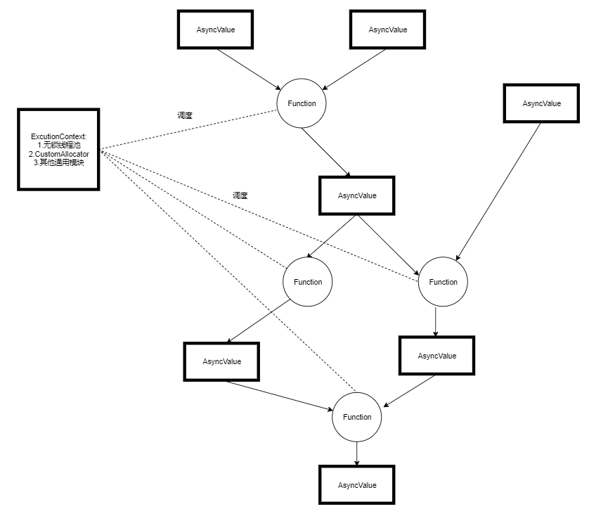

# Async库代码规范  
1. 在项目内部尽量保证使用Forward Declaration来实现，减少编译时间，但是不要跨Lib使用Forward Declaration(eg. 比如使用同样在common分支下的machine_learning中的类的Forward Decalaration)  
2. 不要引入boost，尽量不要引入sss中其他代码，保证async模块是独立的基础模块 
3. 每次修改代码后，使用bash run_clang_format.sh 保证代码缩进和风格的一致，目前采用BaseOnStyle=LLVM的方式  
4. 实现相应功能后在tests目录下增加相应的简单功能测试(当前测的有些随意，后续应该用GTest测试)  
5. 尽量避免在Async代码中引入shared_ptr,使用unique_ptr  
# Async库代码架构  
Core Classes  
1. AsyncValue  
2. Allocator  
3. HostHost  
4. ConcurrentQueue  
5. Tracing && Porfiler  
6. RCReference

# 简单架构图
  

